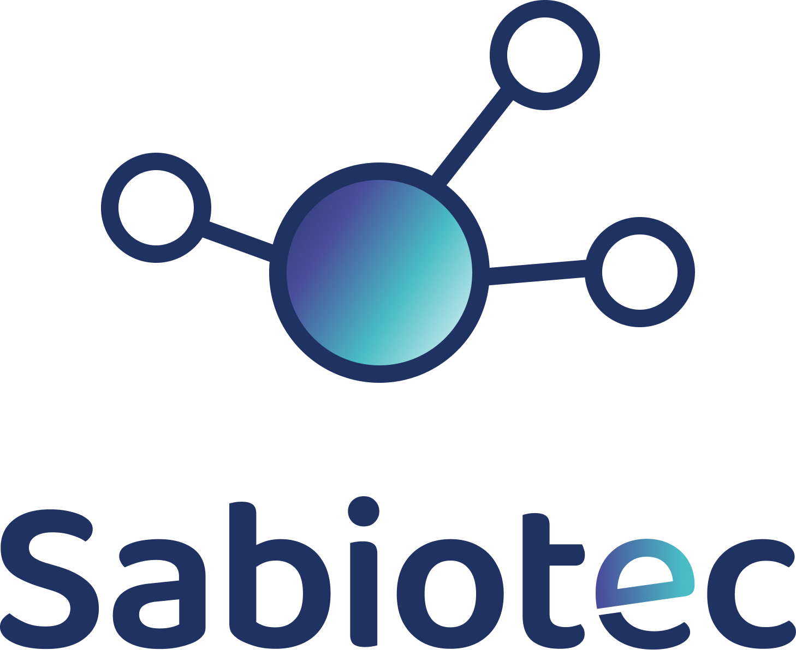

<h2 align="center"> Algoritmo de recomendación </h2>

<h1 align="center">
   
  
</h1>

Proyecto del equipo de Data Science para el Desafío de Tripulaciones en The Bridge, promoción de Abril 2022.

El proyecto del desafío consiste en la creación de una aplicación para ayudar a personas mayores a adquirir conocimientos sobre las tecnologías. La aplicación está formada por vídeos de aprendizaje y juegos para afianzar los conocimientos adquiridos durante la visualización de los primeros. 

Se ha creado un algoritmo de recomendación de vídeos basado en las valoraciones del usuario a cada vídeo.

Los datos empleados para el desarrollo del algoritmo son datos ficticios ajustados al **[informe sobre la brecha digital y las personas mayores](https://www.mayoresudp.org/wp-content/uploads/2021/11/54481ISAS01-Informe-Participaci%C2%A2n-en-mbito-rural.pdf)**, realizado en Mayores UDP en España.
 
El modelo está implementado, utilizando python como lenguaje de programación, realizando una API con FastAPI y utilizando la base de datos MongoDB.

### Autores:
* Adán Bustos 
* Claudia Balderas
* Sara Galán
